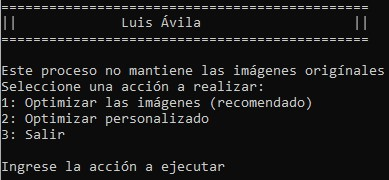
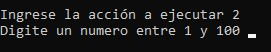
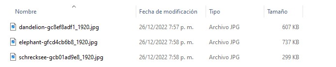
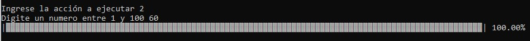
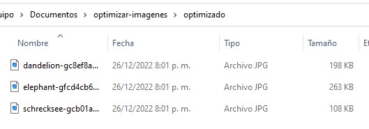

# optimizar imagenes para web
Este recurso es simple pero permite optimizar las imagen para las webs

en el menú si escoge la segunda opción en este podrá indicar el nivel de compresión entre mas cercano a 0 la imagen quedara de muy baja calidad y entre mas tienda a 100 menos comprimida la imagen quedara 

El script tiene dos carpetas que se deben poner atención 
* para-optimizar: En esta carpeta se debe colocar las imágenes que se requieren comprimir 
* optimizado: En esta carpeta quedara el resultado de todas las imágenes procesadas (.jpeg, .jpg y png)

> NOTA: Las imágenes de la primera carpeta serán removidas a medida se optimicen  
> NOTA: Se debe tener en cuenta que este es un sistema en python

* Se debe tener instaldo adicionalmente `pip install pillow`

